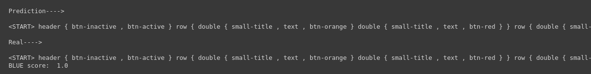

# Pix2Code

Within three years deep learning will change front-end development. It will increase prototyping speed and lower the barrier for building software. The field took off last year when Tony Beltramelli introduced the [pix2code paper](https://arxiv.org/abs/1705.07962) and Airbnb launched [sketch2code](https://airbnb.design/sketching-interfaces/). Currently, the largest barrier to automating front-end development is computing power. However, we can use current deep learning algorithms, along with synthesized training data, to start exploring artificial front-end automation right now!

## Turning Design Mockups Into Code With Deep Learning

In this repository , I’ll build a neural network to code a basic a HTML and CSS website based on a picture of a design mockup.

*Image from the [Blog](https://blog.floydhub.com/turning-design-mockups-into-code-with-deep-learning/)*

We’ll use a dataset of generated bootstrap websites from the [pix2code paper](https://arxiv.org/abs/1705.07962). By using Twitter’s [bootstrap](https://getbootstrap.com/), we can combine HTML and CSS and decrease the size of the vocabulary.

Instead of training it on the bootstrap markup, we’ll use 17 simplified tokens that we then translate into HTML and CSS. The [dataset](https://github.com/tonybeltramelli/pix2code/tree/master/datasets) includes 1500 test screenshots and 250 validation images. For each screenshot there are on average 65 tokens, resulting in 96925 training examples.

By tweaking the model in the pix2code paper, the model can predict the web components with 97% accuracy ([BLEU](https://en.wikipedia.org/wiki/BLEU) 4-ngram greedy search).

We will:

- Preprocess webpage images and the code related HTML for this mixed NLP-CV task
- Build and train the `pix2code` model using Keras and Tensorflow
- Evaluate our model on the test set

## Model Architecture for pix2code

implementation of the below Deep learning model can be discovered inside the jupyter notebook

## Trained Model Results 

## Model predicted HTML , CSS Code rendered results on Google Chrome

* link to index.html file to check the results [click here](assets/index.html)
* link to my pretrained model to reproduce the results [click here](https://drive.google.com/file/d/10P31XQdVFmNimDlV_DbJ-WIdTAlClTI7/view?usp=sharing)

* Try this notebook uer self becuase it's easy to use with googel colab platform and gets your hands dirty .